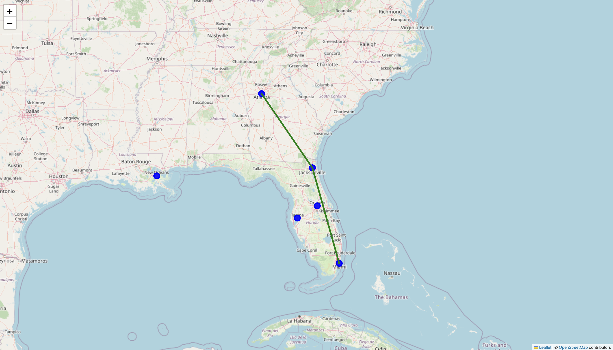

# Real-Time Disaster Alert & Supply Chain Routing System

This project is a real-time, geospatial disaster-aware routing system that detects natural disasters (earthquakes via USGS) and dynamically reroutes supply chains on an interactive map.

---

## Features

- **Live Earthquake Data** from USGS GeoJSON API
- **Folium-based Interactive Map** with node + route visualization
- **Auto-built Supply Chain Graph** from CSV input
- **Disaster Zone Detection** (geopy + proximity radius)
- **Shortest & Safest Route Calculation** using Dijkstra’s Algorithm
- **CSV-Driven Scalability** (plug-and-play new nodes)
- **Offline HTML Map Output** to visualize affected paths

---

##  Project Structure

```
Real-Time-Disaster-Routing/
├── disaster_supply_chain.py         # Main Python logic
├── supply_nodes.csv                 # Warehouse/delivery nodes
├── disaster_supply_chain_map.html  # Generated output map
├── requirements.txt                 # Pip dependencies
└── README.md                        # You're reading this!
```

---

##  Setup Instructions

1. Clone the repo or download the folder
2. Install dependencies:

```bash
pip install -r requirements.txt
```

3. Run the script:

```bash
python disaster_supply_chain.py
```

4. Open the map:

```bash
open disaster_supply_chain_map.html
```

---

##  How It Works

1. Reads `supply_nodes.csv` and maps each node with lat/lon
2. Builds a graph by connecting nodes that are within 600km
3. Pulls earthquake data from the past 24 hours via USGS API
4. Flags any supply chain node within 200km of a disaster
5. Computes the shortest or safest path from source to destination
6. Saves and displays everything in an interactive Folium map

---

## Screenshots




---

##  Future Ideas

- Add wildfire/flood detection via NASA/NOAA
- Deploy as Streamlit dashboard
- Add Kafka or database ingestion
- Visualize severity zones based on disaster magnitude

---

## Built By

**Raghuram Gopal Ganta**  
Data Engineering | Florida Atlantic University | Class of 2025


